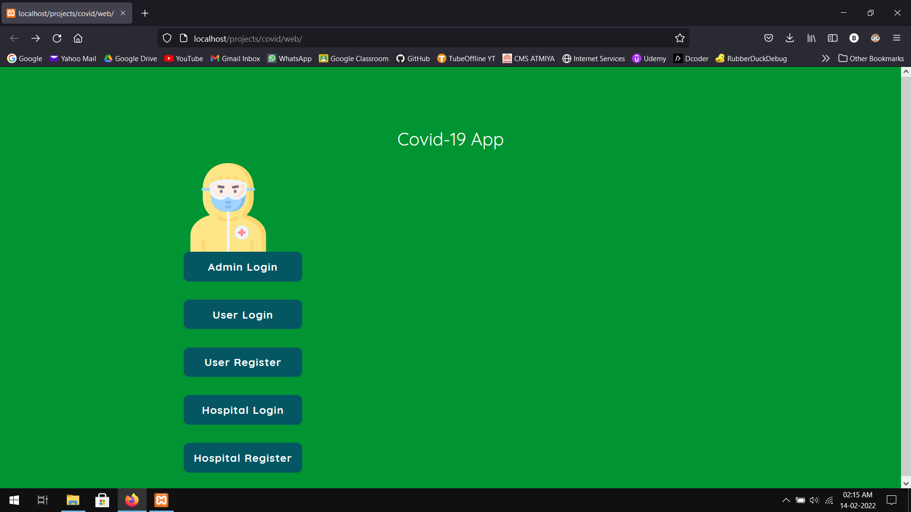
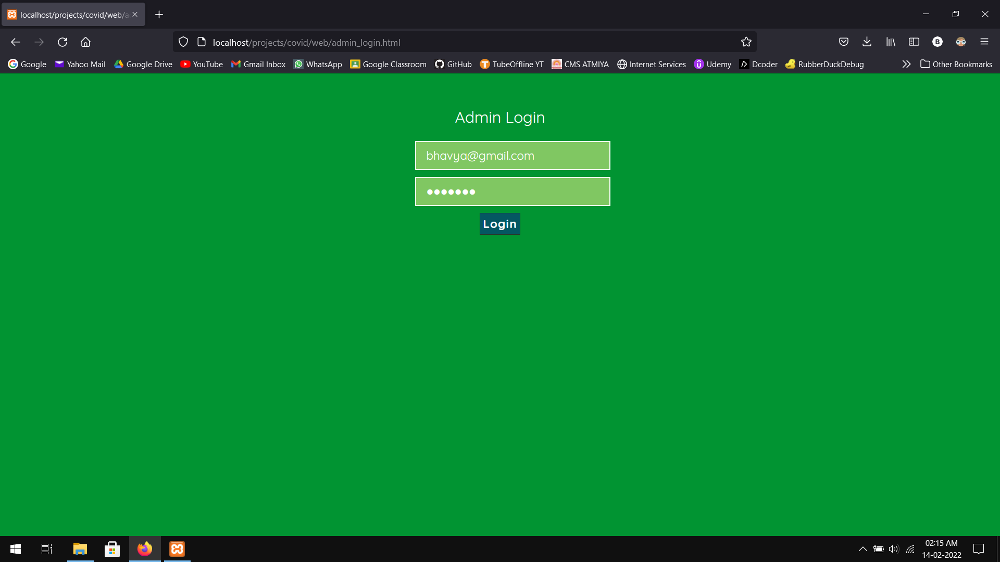
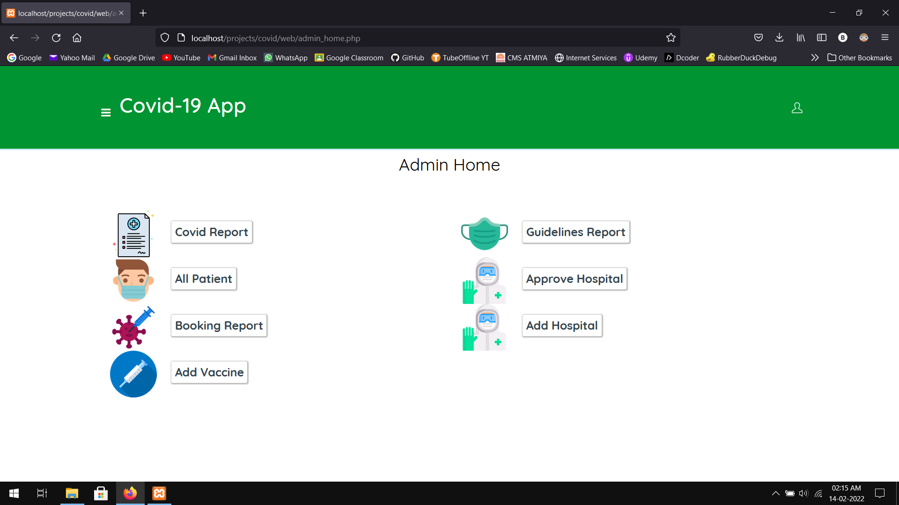
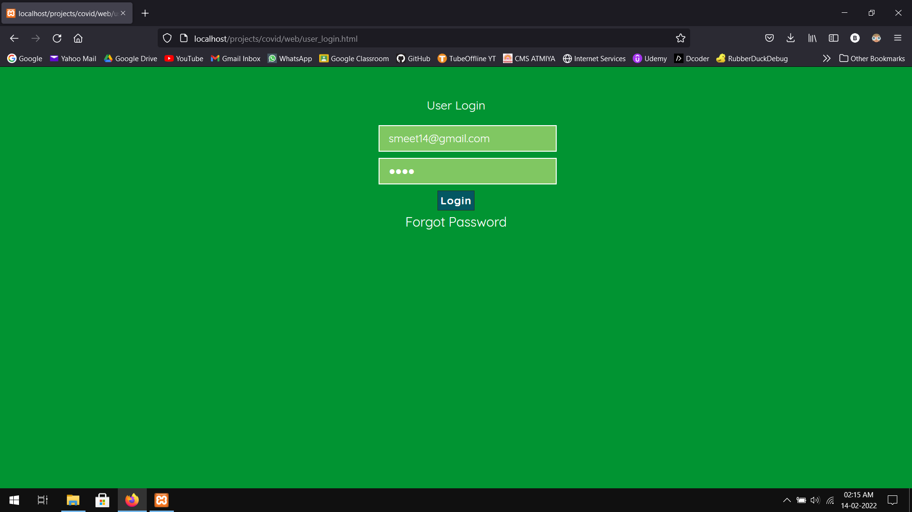
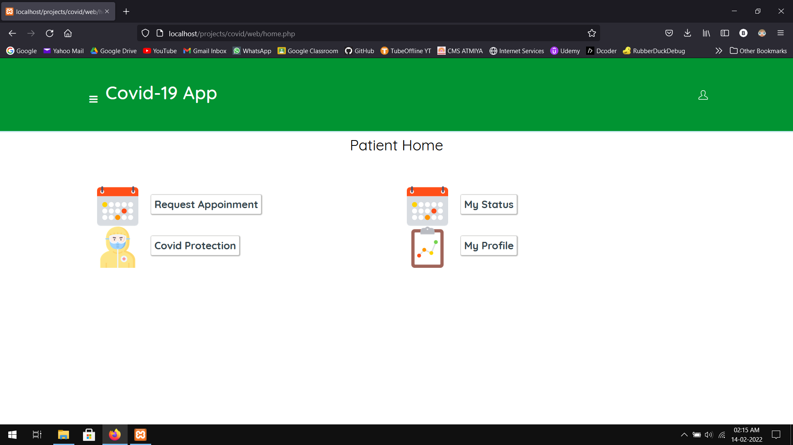
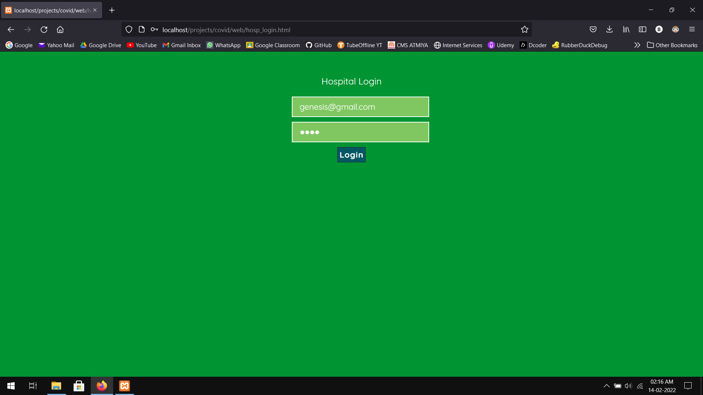
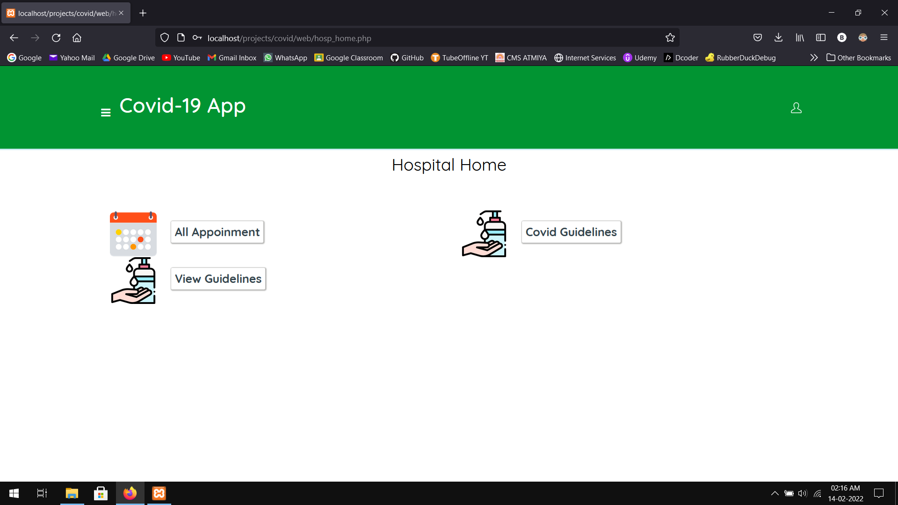
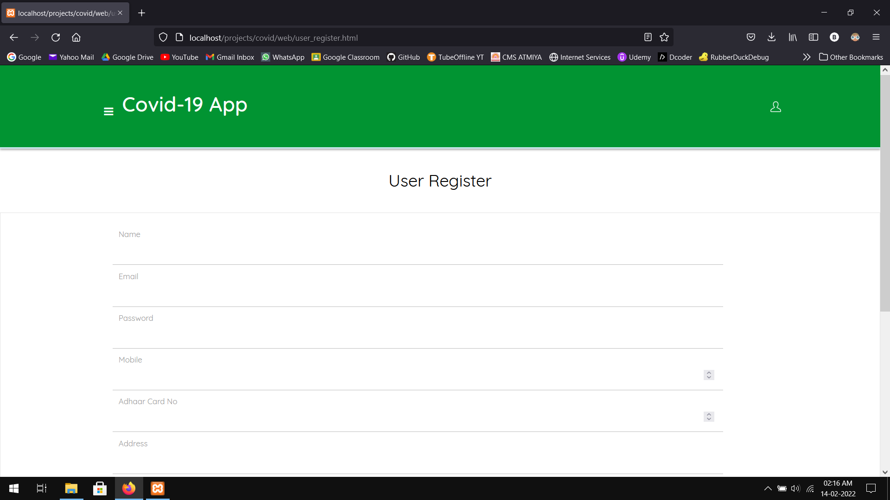
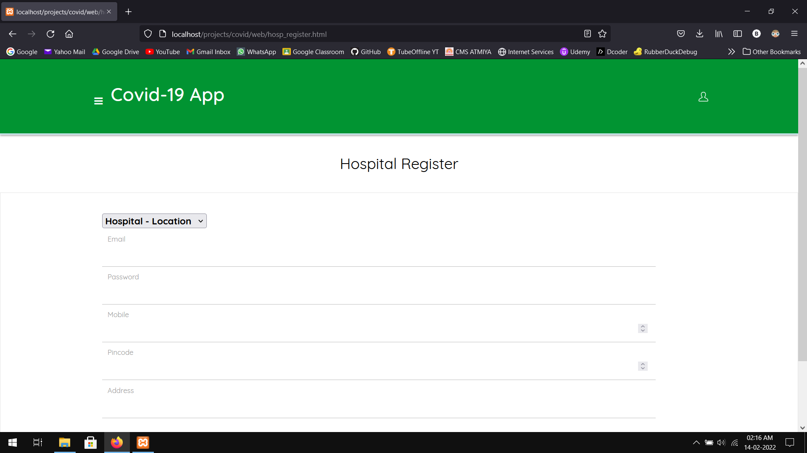

# PHP/MySQL Covid-19 Web App

This is my academic project for my final year in my B.Sc. (IT)

## About this Project

- Objective of this project is to create system which maintains Patients’ data about their Covid Status.
- The main Roles of this system are:
1) Admin
2) Hospitals (Who helps to provide tests and vaccines of Covid)
3) Patients.

- Following activities are covered through our application:
  - Admin:
    - Login/Register  
    - View reports of all patients 
    - View reports of vaccines
    - Approve hospitals
    - See list of all the hospitals
    - See booking details of all the patients
  - Hospitals:
    - Login/Register 
    - Provide tests of Covid
    - Provide vaccines of Covid and other diseases
    - Provide guidelines for symptoms Optionally
  - Patients:
    - Login/Register 
    - Seek help regarding their covid tests/vaccines
    - View their covid status
    - View guidelines

## How to Use this Project?

Tools you will need:
- XAMPP
- Web Browser
- Sublime Text (or similar)

Steps to Run the Project:
- Download and install this version of <a href="https://drive.google.com/file/d/1jlrcOOZ44E-IFkZt_BoO-_vIgcfJNhEM/view?usp=sharing">XAMPP</a> (For some reason, this project only works on this version)
- Copy all the contents of source folder and copy it to "C:\xampp\htdocs\projects\covid\web"
- Run XAMPP and Start Apache and MySQL
- Go to phpMyAdmin and create an empty database named "covid"
- Import covid.sql from the project
- In the browser, type the URL "localhost/projects/covid/web" to get to the Entry point of the project
- Use the following E-Mail/Password Combo's for Testing purposes:
  - Admin: "bhavya@gmail.com", "test123"
  - Hospital: "genesis@gmail.com", "test"
  - Patient: "smeet14@gmail.com", "test"

Steps to Edit this project:
- Download Sublime Text
- Open our source folder in Sublime Text

## Screenshots

**Entry Point (index.html)**

**Admin Login**

**Admin Home**

**Patient Login**

**Patient Home**

**Hospital Login**

**Hospital Home**

**Patient Register**

**Hospital Register**

